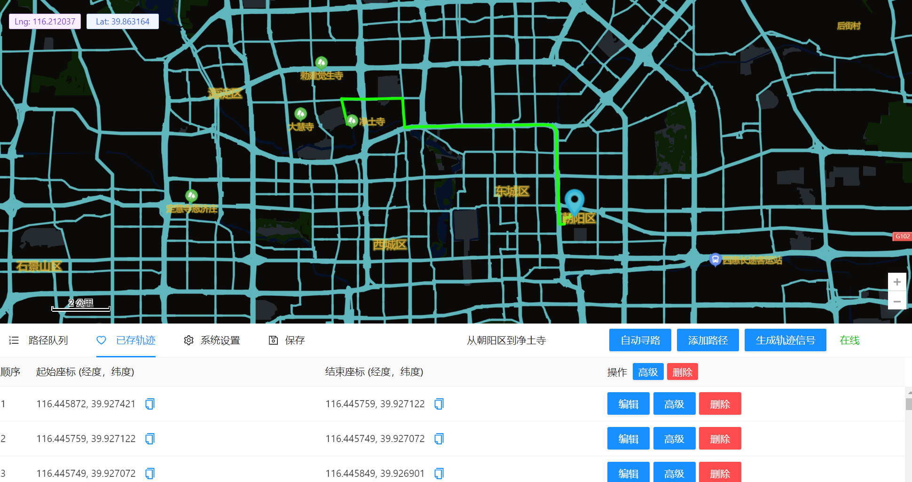

# GPS Cheat Backend

## Requirements

- gr-osmosdr
- GNURadio

## Features

- Support HackRF One, USRP B210, BladeRF, BladeRF 2, LimeSDR.
- Dynamic tracks generating & transmiting.
- Realtime location transmiting.
- Driving pattern simulator.
- Driving tracks editor.
- Driving tracks storing.

## Usage

```
virtualenv -p /usr/local/bin/python3.10 venv
pip install -r requirements.txt
source ./venv/bin/activate
```

Update Broadcast File

```
python getbrdc.py
```

Run GPS Cheat

```
python webserver.py
```



## Deploy

```shell
cp ./gps_cheat.service /etc/systemd/system/gps_cheat.service
systemctl enable gps_cheat.service
systemctl start gps_cheat.service
```

## 编译

```
gcc -c -fPIC -I/usr/include/python3.10 kml2GGA.c
gcc -c -fPIC -I/usr/local/include/python3.9 kml2GGA.c
gcc -shared kml2GGA.o -o kml2GGA.so
```

```
nuitka3 --follow-import-to=gnuradio_transfer --follow-import-to=kml2GGA ./webserver.py -o ./gps_cheat_server
```

```
docker run -itd --privileged --net=host -v /dev/bus/usb:/dev/bus/usb --name=gps_cheat
docker run -it --privileged --net=host -v /dev/bus/usb:/dev/bus/usb --name gps_cheat ubuntu:focal bash
```

```
pacman -S gnuradio usbutils libuhd gnuradio-osmosdr limesuite soapysdr bladerf hackrf python-gevent python-flask
```

## 使用说明

[使用说明](./usage/USAGE.md)

## TODO

优化前端体验
默认实时定位时间
轨迹模拟默认时间
默认轨迹特征设置
用谷歌地图