# 使用说明
## 研发目的
该系统旨在搭建一个方便易用，功能完全的GPS欺骗系统。
当前公布的GPS欺骗系统的搭建方法都比较麻烦，且功能比较单一，操作复杂，没有一个完整的操作界面与流程。
针对研究需要，该系统能够提供一套完整的web操作界面，支持多种无线电设备，功能丰富并拥有完善的使用文档。

GPS Cheat可以支持服务启动，也可以支持手动启动。

首先运行服务

```
python webserver.py
```

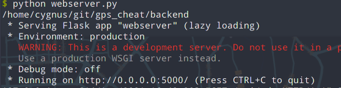

打开URL，页面会自动初始化地图组件，默认位置为北京。

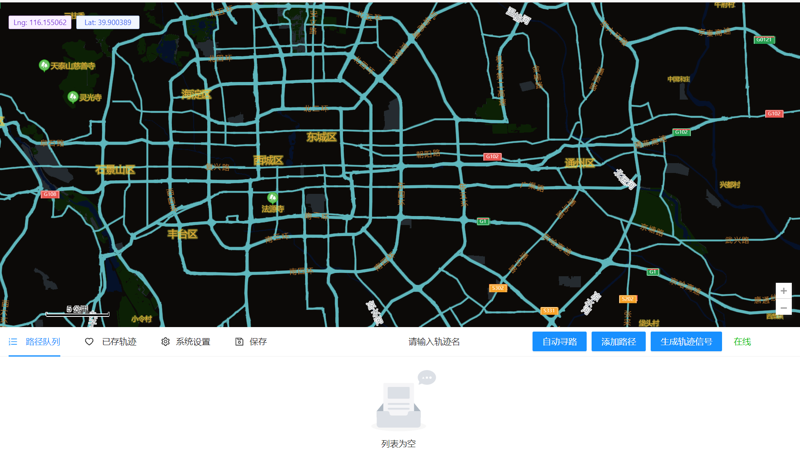

插入SDR，右侧红色文字“离线”，会变成“在线”


## 实时定位

在地图任意位置单击右键，可以弹出菜单，点击“实时定位”，GPS Cheat就会生成并发射当前位置的无线电信号。

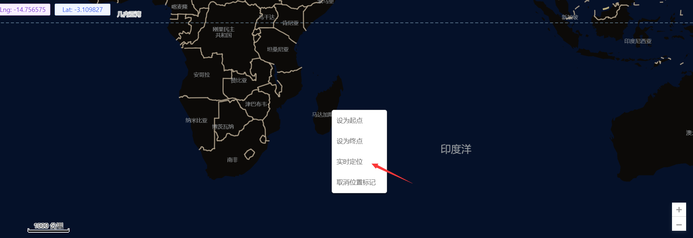

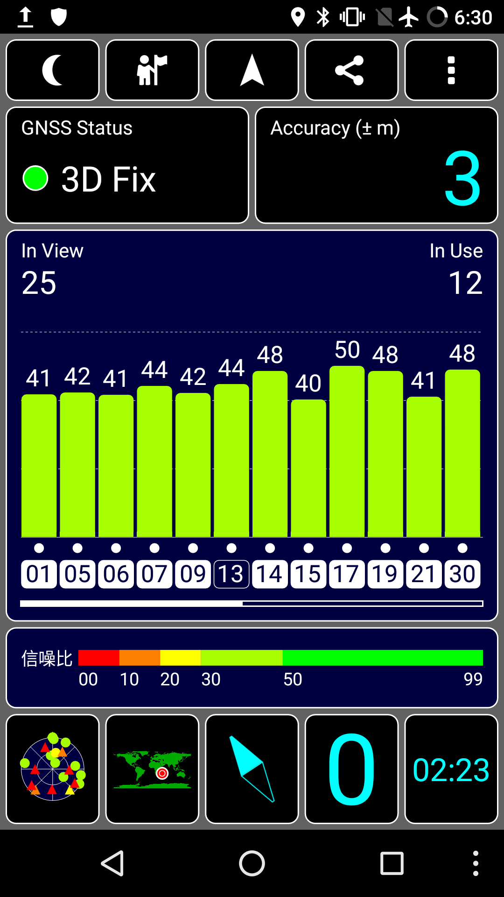

## 行驶路线模拟

### 自动寻路

首先在地图上单击右键设置起点和终点

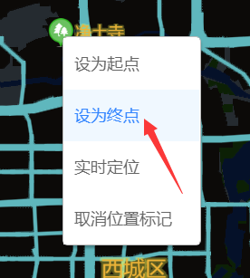

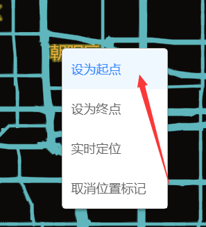

可以在地图上看到两个游标，绿色为起始点，红色为结束点

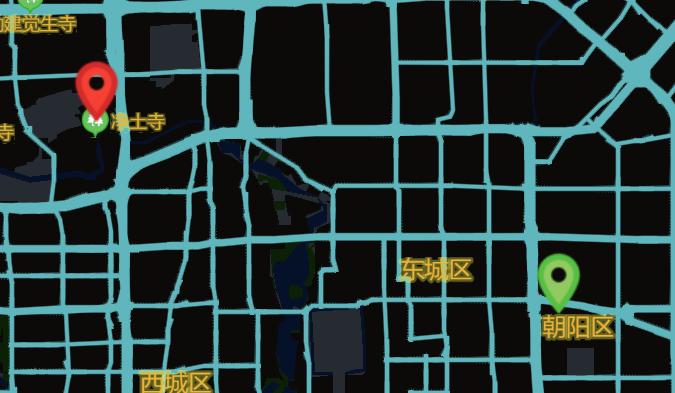

首先确保路径队列是空的，然后点击下方菜单的”自动寻路“按钮


地图上方会出现路线选项，最多三个。选择“常规路线”，然后在弹出的气泡上单击“添加此路线到路径队列”。

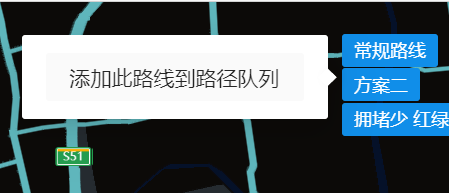

地图上将会出现带颜色的路线

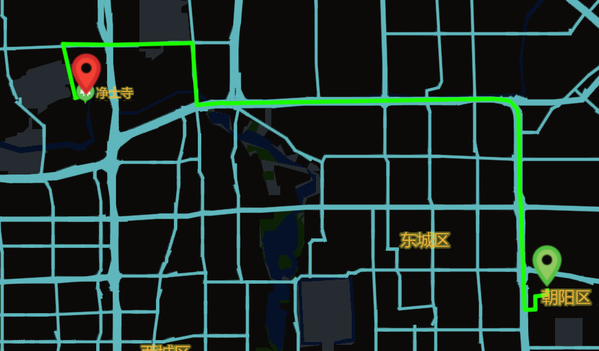

下方的路径队列会出现每条线段的座标信息。


在下方列表的标题栏点击“高级”，选择“轿车”

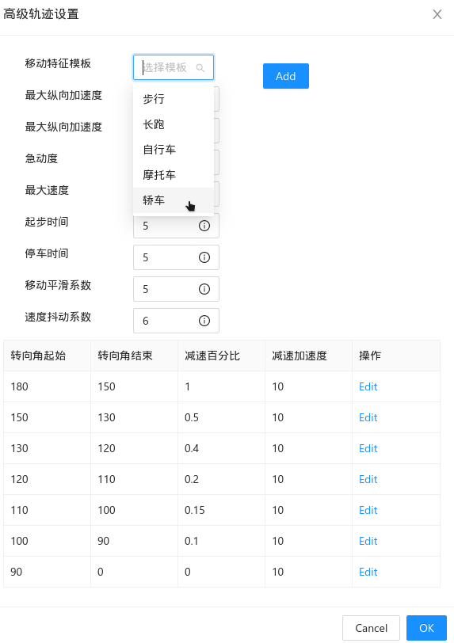

一般来说 GPS 接收设备20秒就可以获得定位，起步时间可以设长一点。点击“OK”，将会批量设置所有路径的轨迹特征。


点击“请输入轨迹名”，


然后将路径队列保存到系统

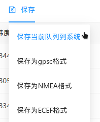

点击“生成轨迹信号”，系统就会生成模拟的轨迹信息，并且会发送无线电信号


可以看到GPS欺骗成功，精度4米，速度为18km/h

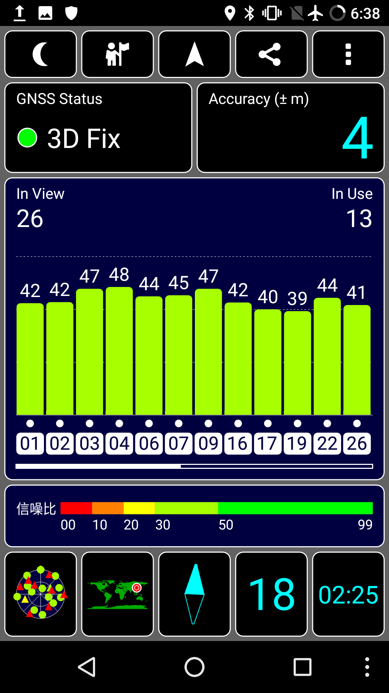

### 选择已存轨迹

点击“已存队列”，选择要模拟的轨迹。


路径队列就会显示每一条路径


### 手动设置轨迹

有些场景自动寻路无法做到，需要手动设置。


首先设置好起始位置和结束位置，点击“添加路径”


路径队列则会出现一条直线路径路径

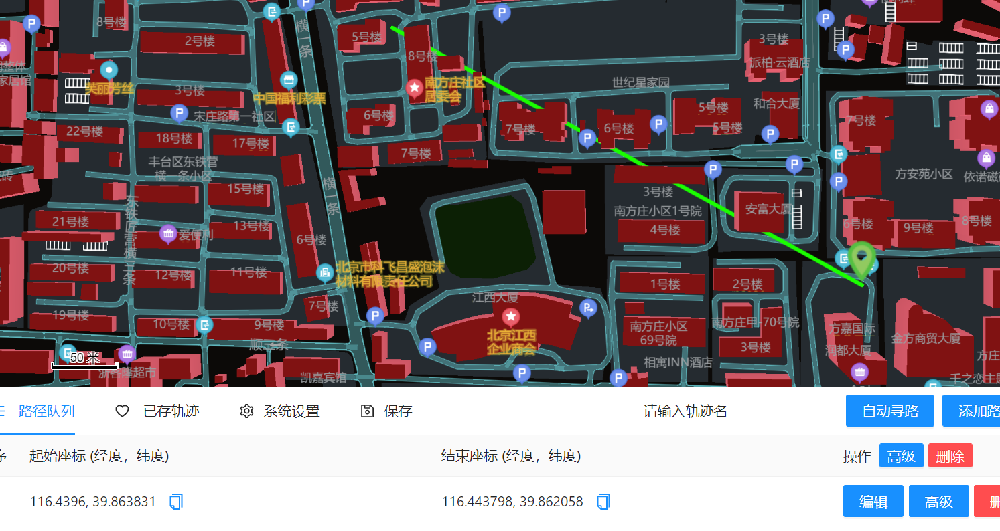

点击编辑按钮可以修改起点与终点的坐标


接着可以继续添加第二段路径，可以重新在地图上选取起点与终点，在点击添加路径，就可以在队列路径中新增一条路径，注意不要选择相同的起点和终点，在每一次选择好路径之后，系统默认会将前一条路径的终点设置为下一条路径的起点。

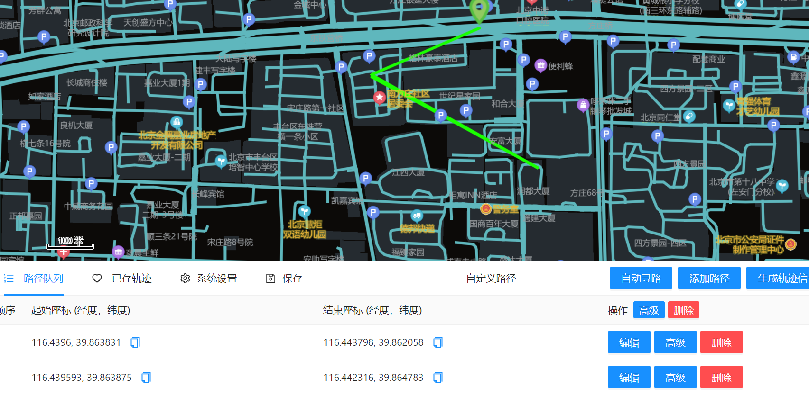

用此方法可以画出想要的轨迹

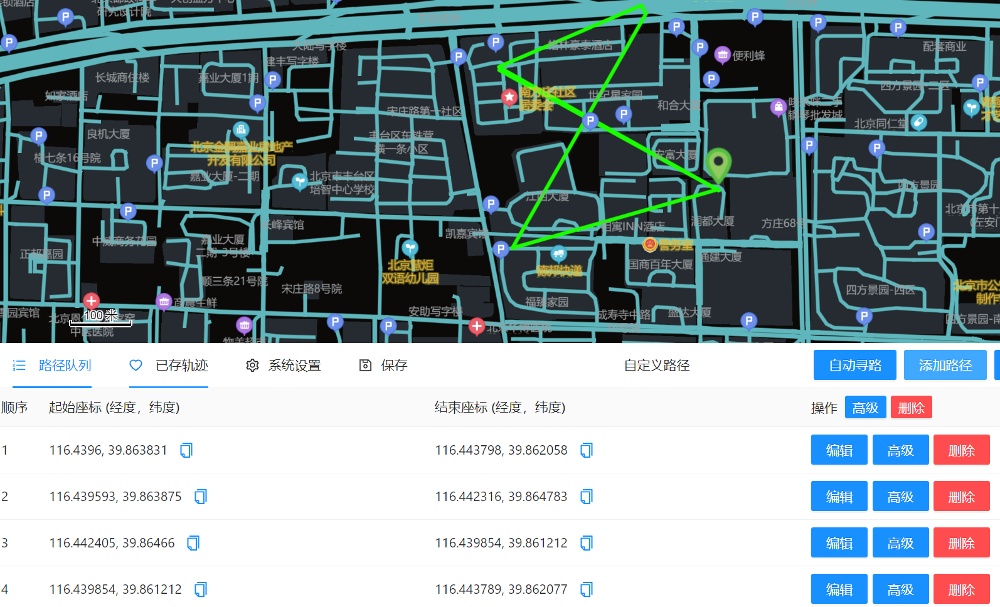

## 注意事项

支持热插拔，但是不要插拔太快，可能会出错

GPS定位时间需要15秒以上，初始化也需要时间，因此定位功能不要切换太频繁
